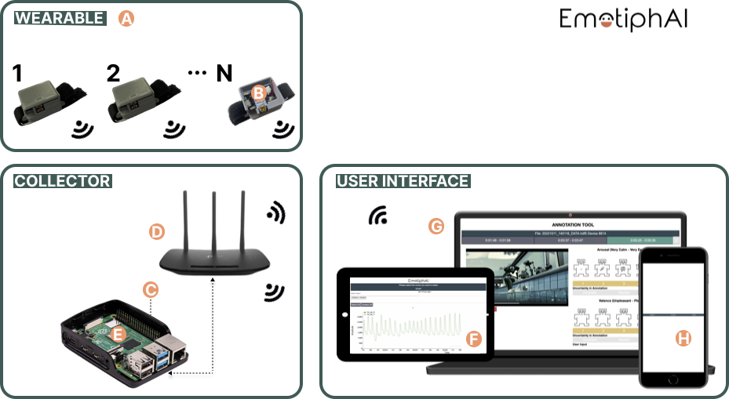
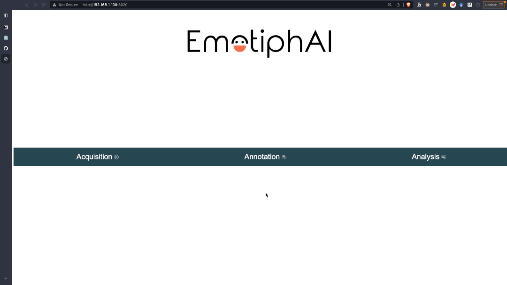

# EmotiphAI_public
A platform for group physiological data collection and retrospective emotion annotation.

The EmotiphAI platform consists of a low-cost standalone local infrastructure, a wearable device, and an end-user interface for real-time data visualisation and emotion annotation.

Scientific paper [available](https://link.springer.com/article/10.1007/s00521-022-07191-8).

## Results
The platform works both for bluetooth and WiFi. Using TP-Link Wireless N 450Mbps (TL-WR940N) WiFi and an odroid it enables data collection up to 30 devices at 50Hz (1 channel), or 10 devices at 100 Hz (2 channels).

The EmotiphAI platform was used to collect a real-world [dataset](https://github.com/PatriciaBota/g-rex_public) with more than 350h of data collected.

<div align="center">
  
</div>

## DEMOs
<div style="display: flex; justify-content: center; align-items: center;">
  
  
</div>

## Installation
Installation can be easily done with the `Clone or Download` button above:

```bash
$ git clone https://github.com/PatriciaBota/EmotiphAI.git
```

## Configuration
- Configurations can be found at fastapi/src/core/config.py

## Run
1. make create-venv
1. make install
2. make run


## Acknowledge
This work was funded by FCT - Fundação para a Ciência e a Tecnologia under grants 2020.06675.BD and FCT (PCIF/SSO/0163/2019 SafeFire), FCT/MCTES national funds, co-funded EU (UIDB/50008/2020 NICE-HOME), Xinhua Net FMCI (S-0003-LX-18), Ministry of Economy and Competitiveness of the Spanish Government co-founded by ERDF (TIN2017-85409-P PhysComp), and IT - Instituto de Telecomunicacações, by the European Regional Development Fund (FEDER) through the Operational Competitiveness and Internationalization Programme (COMPETE 2020), and by National Funds (OE) through the FCT under the LISBOA-01-0247-FEDER-069918 “CardioLeather” and LISBOA-1-0247-FEDER-113480 “EpilFootSense”.
